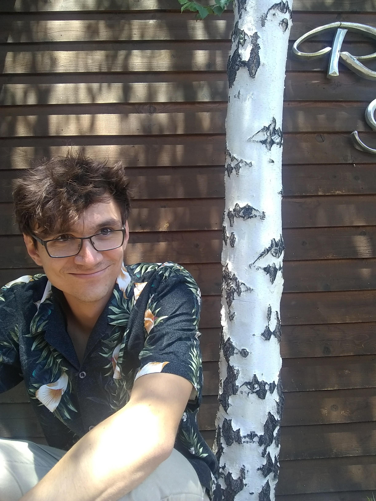

<!-- # 1st Workshop on Distributed Computing with Emerging Hardware Technology -->

<!-- ### In conjunction with [PODC'24](https://www.podc.org/podc2024/), Nantes, France, June 17-21, 2024 -->

### June 21th, 2024. Colocated with [PODC'24](https://www.podc.org/podc2024/) and [SPAA'24](https://spaa.acm.org/). Nantes, France.

## Overview and scope

EMERALD aims at investigating how the utilization of future and emerging hardware technology can influence (or add to) the foundations of concurrent and distributed computing. The workshop will host a series of invited talks which will contribute to the better understanding of how such technology could change what we know about concurrent and distributed algorithms and models. The emphasis will be on persistent memory computing, NUMA-aware computing, distributed computing in systems with Remote Direct Memory Accesses (RDMA), distributed and concurrent computing on top of heterogeneous hardware, processing in memory (PIM), near-memory processing (NMP), disaggregated/composable systems, and others. 
The topics covered by EMERALD specialize the following broader topics for systems that feature modern, emerging or future hardware technology:

- concurrency, synchronization, and persistence 
- design and analysis of concurrent and distributed algorithms
- distributed and concurrent data structures
- fault-tolerance, self-organization, and self-stabilization
- lower bounds and impossibility results for distributed computing
- multiprocessor and multi-core architectures and algorithms
- transactional memory

Through a carefully-chosen collection of invited talks, EMERALD aspires to reveal realistic and practical aspects that can positively influence theory research, in whatever regards the choice of the problems to work on, the right level of abstraction to study them, how to come up with realistic models for computation, how to efficiently support additional desirable features (persistence, NUMA-awareness, architecture-specific design) when designing concurrent and distributed algorithms, while maintaining or improving their performance characteristics, etc. 
EMERALD will be a full-day event.  In addition to hosting lectures by invited speakers, it will feature an open discussion session aiming at highlighting important problems for future research. 

## Speakers

 - **Naama Ben David**, Technion, Israel

- **Gregory Chockler**, University of Surrey, UK

- **Denisa-Andreea Constantinescu**, EPFL, Switzerland

- **Panagiota Fatourou**, University of Crete and FORTH, Greece

- **Phillip Gibbons**, Carnegie Mellon University, US

- **Wojciech Golab**, University of Waterloo, Canada

- **George Hodgkins**, University of Colorado, Boulder and Sandia National Lab, US

- **Jim Larus**, EPFL, Switzerland

- **Roberto Palmieri**, Lehigh University, US

- **João Barreto**, University of Lisbon and INESC-ID, Portugal

- **Erez Petrank**, Technion, Israel

- **Paolo Romano**, University of Lisbon and INESC-ID, Portugal

- **Eric Ruppert**, York University, Canada

- **Samuel Thomas**, Brown University, US

- **Gala Yadgar**, Technion, Israel

## Program

The workshop takes place on June 21st, 2024. 

| Time  | Activity  |
|---|---|
| 9:00 – 10:30 |	1st Session of Invited Talks |
| 10:30 – 10:50 |	Coffee Break |
| 10:50 – 12:20 |	2nd Session of Invited Talks |
| 12:20 – 14:00 |	Lunch |
| 14:00 – 15:30 |	3rd Session of Invited Talks |
| 15:30 – 16:00 |	Coffee Break |
| 16:00  – 18:00 | Discussion Session - Panel |

## Talks

<table style="width:100%">
    <tbody>
        <tr>
            <td><h4>LOCO: Building Applications in Network Memory with Cross-Node Objects</h4>   <b>George Hodgkins</b>   University of Colorado, Boulder and Sandia National Lab, US</td>
            <td width="150"> </td>
        </tr>
        <tr>
            <td colspan=2>
            <button class="accordion">Show/hide abstract</button>
            

              
In this talk, we explore the the idea of objects as a programming model for clusters using network memory (RDMA or CXL). We argue that the natural representation of an application designed for network memory is a system of interconnected objects which extend well-defined methods to the programmer, similar to traditional object-oriented application designs. These concurrent objects store their state in a distributed fashion across all participating nodes, especially in an incoherent or uncacheable memory network. In a sense, channel state is stored "across the network".

                
Based on this philosophy, we introduce the Library of Channel Objects (LOCO), a shared-memory-like object-based library for RDMA and extensible to other weak memories. Channels are composable and reusable, and designed for both the strong locality effects and the weak consistency of RDMA.  Unlike prior work, LOCO channels do not hide memory complexity, instead relying on the programmer to use NUMA-like techniques to explicitly manage each object. As a consequence, our channel objects have performance similar to custom RDMA systems (e.g. distributed maps), but with a far simpler programming model. Our distributed map channel has better read and comparable write performance to a state-of-the-art custom RDMA solution, using well-encapsulated and reusable primitives.

            

            </td>
        </tr>
    </tbody>
</table>

<!-- 
<table>
    <tbody>
        <tr>
            <td><h4>Hardware-Accelerated, Fine-Grain BSP</h4>   <b>James Larus</b>   EPFL, Switzerland</td>
            <td width="150"> </td>
        </tr>
        <tr>
            <td colspan=2>
            <button class="accordion">Show/hide abstract</button>
            

            

            </td>
        </tr>
    </tbody>
</table> -->

<!--  -->

<!-- 





 -->

## Organization committee

- Iris Bahar, Colorado School of Mines, USA
- João Barreto, INESC-ID, Portugal
- Panagiota Fatourou, University of Crete and Foundation for Research and Technology – Hellas
(FORTH), Greece
- Maurice Herlihy, Brown University, USA
- Erez Petrank, Technion, Israel

Contact: Panagiota Fatourou <faturu@ics.forth.gr>

